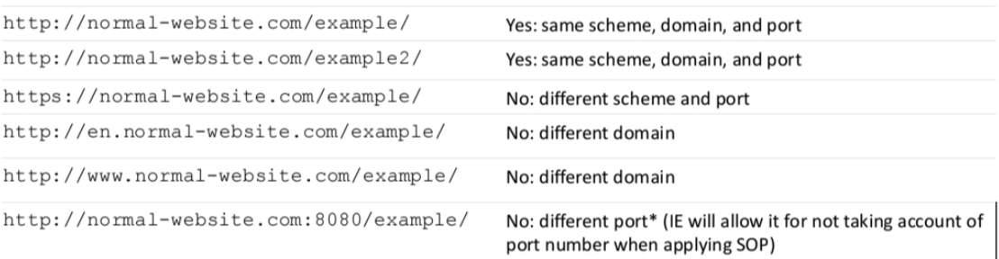

Common questions that might come up during an interview for a WebApp Pen Testing/Red Teaming role

## What happens during a Web VAPT?

From my experience, you first receive the scope and general guidelines from the client. A Nessus scan is then run on the website, and you will then go through the Nessus output and weed out false positives or decide how to add the vulnerability into the final report.

Manual scanning is also conducted alongside Nessus. First, go through the website and document all of the user flows using Burp. Keep a lookout on the headers of each request, how session cookies are stored, any usage of JWTs that could be vulnerable, how admin privileges are checked to authenticate users for restricted documents, or how other business logic like user limits or balances are calculated and edited. Test out common user flow errors and see if you can skip any steps in the user flows or send custom requests through editing in Burp to circumvent certain checks and exploit the system.

Afterward, find out all the fields which accept user input (including header fields, cookies, and URL params) and test common exploitation methods on them. Some examples would be SQLi or XSS payloads, and check if there is a firewall blocking suspicious characters or if there is some kind of cleaning of user inputs. If there is, try to encode the user inputs in different ways and check if it manages to bypass the firewall/cleaning.

We will also run directory busting software on the domain. Personally I use feroxbuster with the default wordlists provided in the kali linux /usr/share libraries but I heard that gobuster can enumerate subdomains as well so I am looking to try that one out soon.

### What are some vulnerabilities you have found during VAPT?

Running feroxbuster, I came across a page where you could view certificates for employees just by entering the employee's name. I recalled earlier in the VAPT where the directory enumeration found another hidden route that had some sort of an employee portal but it was not interactable, but there were several employees' names shown on that page. I tried the names one by one in the certificate page, and not long later I was able to access a signed and verified copy of the certificate for that employee. Such a vulnerability I guess would be classified as Sensitive Data Exposure which has high confidentiality impact on its own but primarily if you want to achieve RCE on the internal system like in OSCP then it can only be useful alongside another attack vector which would ultimately allow the code execution.

### [WIP] How do you weed out false positives on Nessus/more details on Nessus?

### [WIP] For user input, what vulnerabilities do you test for and what payloads do you use?

## [WIP] What is XSS? How do you exploit XSS?

## What is CSRF? How do you exploit CSRF?

CSRF takes advantage of the fact that cookies are passed when u embed another site into your own site. Without the proper security features, if you embed a url that will cause users to do actions like send someone else money or change their password, when the victim visits your site the HTTP request that will be sent will contain their authentication cookie, and cause their account to take actions that they did not want to take.

[Same-origin policy (SOP)](/docs/interviews/Web#same-origin-policy-sop) was then implemented to only allow requests from the same origin to access data from that URL. However, Cross-origin Resource Sharing (CORS) was then created to relax these rules.

### [WIP] CORS and its exploits

## [WIP] What is a JWT? How do you exploit JWT?

## [WIP] What are some measures in place to protect cookies from being stolen? (cookie security flags)

## Same-origin policy (SOP)

SOP is a policy to only allow requests from the same origin (URI scheme, domain, and port number) to access data from that URL.

